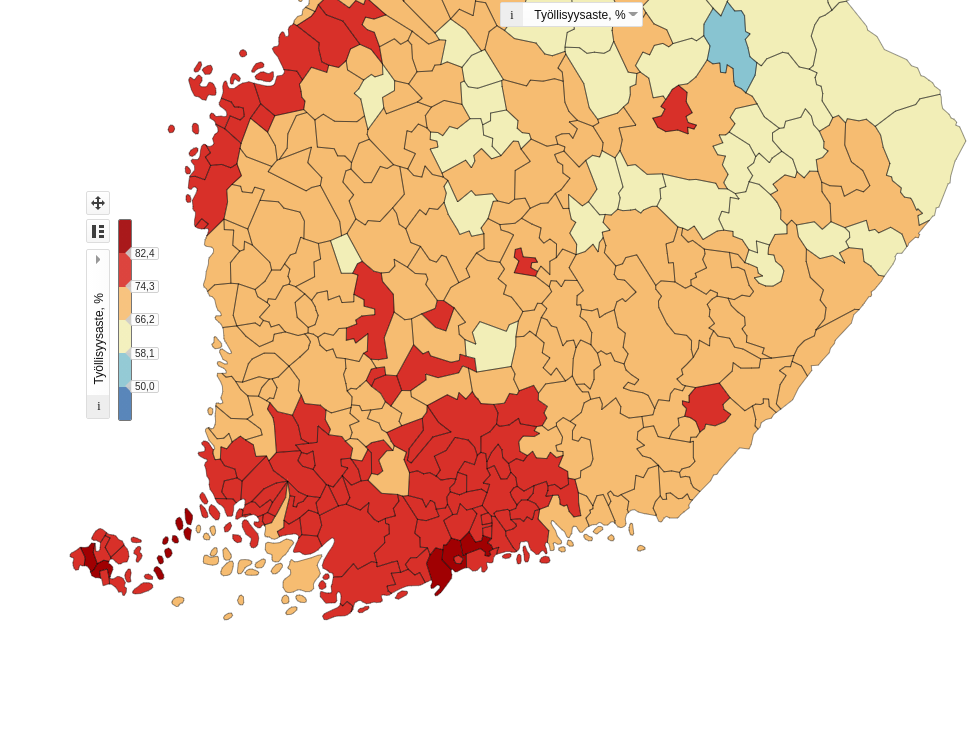
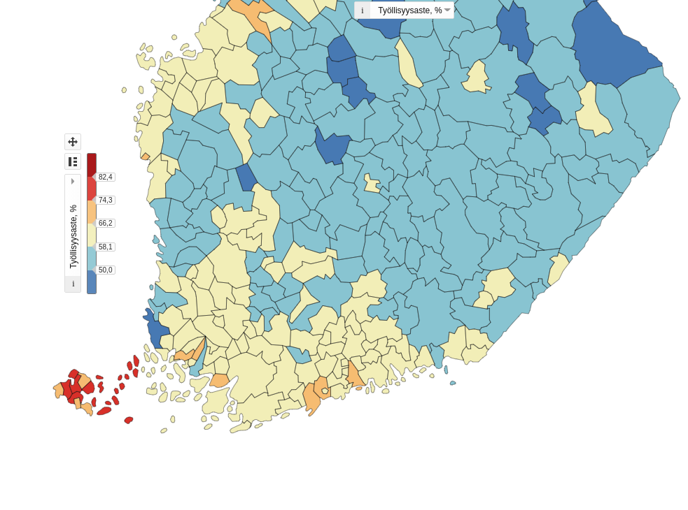
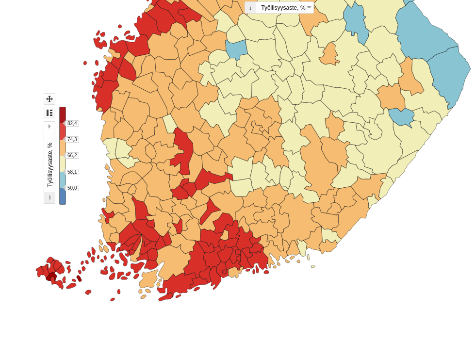
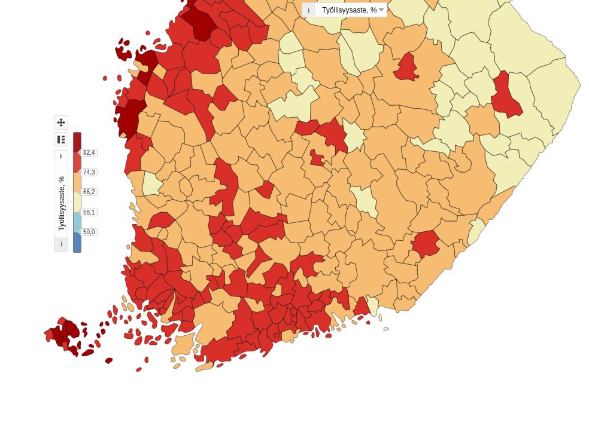

```{r setup, include=FALSE}
knitr::opts_chunk$set(echo=FALSE, message=FALSE, results='show', warning = F)
```

# Introduction

Finland had not fully recovered on a employment level basis from the 1990s recession by the time 2008 economic crisis hit. Like other countries, Finland experienced a sharp downturn but not a mass unemployment like seen in 1990-1994. Contrasting with many countries though, Finland only experienced about a year of increasing employment, before actually falling again in the years up to 2014. In 2018, Finnish employment had finally recovered to almost equivalent level to 1989, but the key difference, the jobs were increasingly concentrated. In 1989 employment in Southern Finland blanketed the whole region, but in 2018 it was highly concentrated the municipalities *surrounding* the main cities of Finland. As seen in Figure 1, all the municipalities surrounding Helsinki have a high employment level, but Helsinki itself is lagging behind. The same happens also in Turku and Tampere, as well as in other large cities such as Jyväskylä, Lappeenranta and Vaasa.

{width=33%} {width=33%} {width=33%}

{#i2018 width=75%}


This divergence is the most apparent in recent years, so I will focus on the available data from 2015 onwards - the period starting from the end of the last downturn. Data does not cover covid-19 period yet, so the whole period is characterized by some of the strongest growth Finland has seen in a long time. The question becomes: **What are the characteristics of these surrounding municipalities?** I have done extensive exploratory analysis on a tool available at the source of the data, where I explored changes for the whole Finland across the period of data available (1987-2018). From there I assumed to have found that there were certain variables that showed clear trends:

- percentage of people under 15 y.o.
- expenditure in social and health activities
- municipal debt per capita
- employment level

The last of which shows heuristically the clearest distinction between the major cities and their surrounding regions.

As all Finnish cities are heterogeneous to each other, I decided so scope this to just the largest cities, and I will pick the surrounding municipalities based on Figure 1, including all the municipalities in the 74.3-82.4% employment- bin. The large cities are Turku, Tampere, as well as Helsinki, Espoo and Vantaa grouped as *Capital cities*.

## Data source

Source of data is Tilastokeskus ([source](https://www.stat.fi/tup/alue/kuntienavainluvut.html#?active1=SSS&year=2021)). The exact link to select variables etc is [*here*](https://pxnet2.stat.fi/PXWeb/pxweb/fi/Kuntien_avainluvut/Kuntien_avainluvut__2021/laaja_alueaikasarjat.px/?rxid=444223df-f91c-4479-891f-5dcd50b983d2).

KPIs of Finnish municipalities over time from 1987 to 2019, as well as the aggregated KPIs from the whole of Finland. Municipalities in the data are based on the 2021 municipality division. Data is included from 397 municipalities + aggregated to cover Finland, and it has 421 variables across time covering 20 years from 1987-2018. I selected a subset of this data as mentioned above.


---


```{r}
cols <- c(
  'Alue.2021',
  'Tiedot',
  'X2015',
  'X2016',
  'X2017',
  'X2018'
)
työllisyys_raw <- read.csv("kuntadata_työllisyys.csv", sep =";", skip = 1, header = T, fileEncoding = "iso-8859-1")
työllisyys <- työllisyys_raw[, cols]


asuminen_raw <- read.csv("kuntadata_asuminen.csv", sep =";", skip = 1, header = T, fileEncoding = "iso-8859-1")
asuminen <- asuminen_raw[, cols]

ikä_raw <- read.csv("kuntadata_ikä.csv", sep =";", skip = 1, header = T, fileEncoding = "iso-8859-1")
ikä <- ikä_raw[, cols]

koulutus_raw <- read.csv("kuntadata_koulutus.csv", sep =";", skip = 1, header = T, fileEncoding = "iso-8859-1")
koulutus <- työllisyys_raw[, cols]

taloudenpito_raw <- read.csv("kuntadata_taloudenpito.csv", sep =";", skip = 1, header = T, fileEncoding = "iso-8859-1")
taloudenpito <- taloudenpito_raw[, cols]


väestötyypit_raw <- read.csv("kuntadata_väestötyypit.csv", sep =";", skip = 1, header = T, fileEncoding = "iso-8859-1")
väestötyypit <- väestötyypit_raw[, cols]
```


```{r}


cols <- c(
  'Alue.2021',
  'Tiedot',
  'X2015',
  'X2016',
  'X2017',
  'X2018'
)

helsinki_surrounding_names <- c(
  'Kauniainen',
  'Inkoo',
  'Siuntio',
  'Lohja',
  'Vihti',
  'Kirkkonummi',
  'Nurmijärvi',
  'Hyvinkää',
  'Tuusula',
  'Järvenpää',
  'Sipoo',
  'Porvoo',
  'Pornainen',
  'Kerava',
  'Mäntsälä',
  'Askola',
  'Pukkila'
)


tampere_surrounding_names <- c(
  'Lempäälä',
  'Pirkkala',
  'Nokia',
  'Kangasala',
  'Ylöjärvi',
  'Pälkäne',
  'Vesilahti',
  'Akaa'
)


turku_surrounding_names <- c(
  'Naantali',
  'Raisio',
  'Masku',
  'Rusko',
  'Nousiainen',
  'Mynämäki',
  'Taivassalo',
  'Vehmaa',
  'Parainen',
  'Kaarina',
  'Lieto',
  'Aura',
  'Pöytyä',
  'Sauvo',
  'Paimio',
  'Marttila'
)

full_data_raw <- rbind(työllisyys,
                   asuminen,
                   ikä,
                   koulutus,
                   taloudenpito,
                   väestötyypit)

capital_surrounding_full_raw <- full_data_raw[full_data_raw$Alue.2021 %in% helsinki_surrounding_names, ]
capital_surrounding_full <- capital_surrounding_full_raw
capital_surrounding_full$group <- 'Capital surrounding'


tampere_surrounding_full_raw <- full_data_raw[full_data_raw$Alue.2021 %in% tampere_surrounding_names, ]
tampere_surrounding_full <- tampere_surrounding_full_raw
tampere_surrounding_full$group <- 'Tampere surrounding'


turku_surrounding_full_raw <- full_data_raw[full_data_raw$Alue.2021 %in% turku_surrounding_names, ]
turku_surrounding_full <- turku_surrounding_full_raw
turku_surrounding_full$group <- 'Turku surrounding'


tampere_full <- full_data_raw[full_data_raw$Alue.2021 == 'Tampere', ]
tampere_full$group <- 'Tampere'

turku_full <- full_data_raw[full_data_raw$Alue.2021 == 'Turku', ]
turku_full$group <- 'Turku'

capital_cities_full_raw <- full_data_raw[full_data_raw$Alue.2021 %in% c('Helsinki', 'Espoo', 'Vantaa'), ]
capital_full <- capital_cities_full_raw
capital_full$group <- 'Capital cities'


full_data <- rbind(
  tampere_full,
  turku_full,
  capital_full,
  tampere_surrounding_full,
  turku_surrounding_full,
  capital_surrounding_full
)


```


# Univariate analysis

I start by seeing what are the differences between the chosen regions in their employment levels. I use % employed, which measures the % of 15-64 y.o. that are employed.


```{r}


library(ggplot2)
library(dplyr)


työllisyysaste_string <- 'Työllisyysaste, %'
 
new_data <- full_data %>%
  group_by(group) %>%
  filter(Tiedot == työllisyysaste_string) %>%
  summarise(
    mean_2018 = round(mean(as.double(X2018), 2)),
    mean_growth = round(mean(as.double(X2018) - as.double(X2015)), 2)
    )


ordered_municipalities <-factor(new_data$group, level = c('Capital cities', 'Capital surrounding', 'Turku', 'Turku surrounding', 'Tampere', 'Tampere surrounding')) 

mean_employment_plot <- ggplot(new_data, aes(x=ordered_municipalities, y=mean_2018)) +
  geom_bar(stat='identity') +
  theme_minimal() +
  labs(x = 'Municipalities',
       y= '% employed',
       title = 'Mean employment in 2018')

```


```{r}
employment_growth_plot <- ggplot(new_data, aes(x=ordered_municipalities, y=mean_growth)) +
  geom_bar(stat='identity') +
  theme_minimal() +
  labs(x = 'Municipalities',
       y= '% point change in employed',
       title = 'Growth in employment from 2014 to 2018')
```

```{r}
library(ggpubr)

cmb.1 <- ggarrange(mean_employment_plot, employment_growth_plot, nrow = 2)

annotate_figure(cmb.1)
```

As we can see from the above, the surrounding municipalities have on average considerably higher employment levels. In Capital cities it was 3%, in Turku 9%, and in Tampere 10%.


Interestingly the change in employment around the capital cities is smaller than that of the capital. Difference between the cities and surrounding municipalities being:

- Capital -0.28% points
- Turku 0.43% points
- Tampere 0.55% points


---

# Bivariate analysis

Here I chose to see if I can find a linear dependency between *the % of people of the surrounding municipalities that are commuting outside of their home municipality to work* and *


```{r}
inf1 <- 'Työllisyysaste, %'
inf2 <- 'Ulospendelöinti, % alueen työllisistä'


 
lm_data.1 <- full_data %>%
  filter(Tiedot %in% c(inf1)) %>%
  filter(group %in% c('Capital surrounding', 'Tampere surrounding', 'Turku surrounding'))

lm_data.2 <- full_data %>%
  filter(Tiedot %in% c(inf2)) %>%
  filter(group %in% c('Capital surrounding', 'Tampere surrounding', 'Turku surrounding'))


risk <- data.frame(risk2015 = as.double(lm_data.1$X2015), risk2018 = as.double(lm_data.1$X2018))
ulospendelöinti <- data.frame(out2015 = as.double(lm_data.2$X2015), out2018 = as.double(lm_data.2$X2018))


lm_data.final <- cbind(risk, ulospendelöinti)


fit2015 <- lm(risk2015 ~ out2015, data = lm_data.final)
print(summary(fit2015))
```


```{r}
plot2015 <- ggplot(fit2015, aes(x = risk2015, y = out2015)) + 
  geom_point() +
  stat_smooth(method = "lm", col = "red") +
  theme_minimal() +
  labs(x = '% employed',
       y= '% working outside of municipality',
       title = '2015')


```

```{r}
fit2018 <- lm(risk2018 ~ out2018, data = lm_data.final)
```


```{r}
plot2018 <- ggplot(fit2018, aes(x = risk2018, y = out2018)) + 
  geom_point() +
  stat_smooth(method = "lm", col = "red") +
  theme_minimal() +
  labs(x = '% employed',
       y= '% working outside of municipality',
       title = '2018')

```


```{r}
library(ggpubr)

cmb <- ggarrange(plot2015, plot2018, ncol=2)

annotate_figure(cmb, top="People commuting to work linearly regressed with employment level")
```


For both 2015 and 2018, with highly different economic situations, the results are statistically significant. However, looking at the graphs, there is significant amount of outliers, especially in the municipalities with a lower employment level. The municipalities with a high employment are tightly linked with the regression line, suggesting that the best doing municipalities are the ones that can make the most out of commuting to their neighboring city. However this is only correlation between the two variables, and such such no contains no causal implications.


---

# Multivariate analysis

I selected to use corrgrams and PCA to find possible correlations, as the data was quantitative, and of high dimension. The initial selection by the author was done based on which variables could:

1. Show variations between the surrounding municipalities, or between them and cities
2. Display key structural trends


```{r}

full_data.2018 <- full_data[, c('Alue.2021', 'group', 'Tiedot', 'X2018')]


library(reshape2)
full_data.2018$X2018 <- as.double(full_data.2018$X2018)

full_data.2018.cast <- dcast(full_data.2018, Alue.2021 + group ~ Tiedot, value.var = 'X2018', fun.aggregate = mean, na.rm = T )

```


```{r}
konsernilaina <- "Konsernin lainakanta, euroa/asukas"


cities <- full_data.2018.cast[full_data.2018.cast$group %in% c('Capital cities', 'Tampere', 'Turku'), ]
surrounding <- full_data.2018.cast[!(full_data.2018.cast$group %in% c('Capital cities', 'Tampere', 'Turku')), ]

```


```{r}


cols.2 <- c(
  'Konsernin lainakanta, euroa/asukas',
  'Työllisyysaste, %',
  'Sosiaali- ja terveystoiminta yhteensä, nettokäyttökustannukset, euroa/asukas',
  'Pientaloissa asuvat asuntokunnat, %',
  'Kerrostaloissa asuvat asuntokunnat, %',
  'Ulkopaikkakuntalaisten omistamat yksityiset kesämökit , %',
  'Alle 15-vuotiaiden osuus väestöstä, %',
  'Yli 64-vuotiaiden osuus väestöstä, %',
  'Väestön keski-ikä',
  'Opiskelijoiden osuus väestöstä, %',
  'Ulospendelöinti, % alueen työllisistä',
  'Sisäänpendelöinti, % alueella työssäkäyvistä'
)
cities.selected <- subset(cities, select=cols.2)
surrounding.selected <- subset(surrounding, select=cols.2)


cols.3 <- c(
  'Loan',
  'Employment',
  'Health costs',
  'Detached',
  'Aps',
  'Cott. goers',
  '<15',
  '>64',
  'Age',
  'Students',
  'Commu. out',
  'Commute in'
)

colnames(cities.selected) <- cols.3
colnames(surrounding.selected) <- cols.3
```

---

Explanations for the variables:


- Loan: per capita dept held by the municipality and companies owned by it
- Employment: % of 15-64 y.o. employed
- Health costs: Expenditure in social and health activities
- Detatched: % of Household-Dwelling Units (HDU, consist of occupants of a dwelling) living in single family houses, two family houses, and two story houses with two HDUs living in different floors.
- Aps: % of HDUs living in apartment buildings
- Cott. goers: percentage of cottages owned by out-of-municipality persons
- &lt;15: % of residents being under 15
- &gt;64: % of residents being 65 or higher
- Age: average age of residents
- Students: % of residents 15 or above being students
- Commu. out: % of workers living in the municipality commuting out 
- Commute in: %  of workers working in the municipality being from other municipalities

---

## Exploring just the surrounding municipalities


```{r, fig.width=10,fig.height=6}
library(corrgram)
corrgram(surrounding.selected, order = T,
         upper.panel=panel.cor)

```


Let's start by looking at employment levels. Interestingly it, and other variables, correlate similarly with both commuters coming in and commuters coming out of these surrounding municipalities. Furthermore, these correlate strongly with each other, so with better connectivity both the employees coming in and going out increase, in conjunction with employment levels.

The largest positive correlation with employment levels is the % of people under 15 in the municipality. Likewise positive correlations are found with the % of people living in detached homes, and a smaller one with the % of population being students.


One possible explanation is that people with relatively stable jobs have high confidence in future, and such the other changes stem from family increases. Important distinction is that neither the % of people living in detached houses nor apartment buildings correlate with % people under 15, but they have opposing mid-sized correlations with employment levels. So the well-to-do municipalities seem to be the ones where the people have the confidence in future, and can afford to live in a detached home.

Interestingly smaller but flipped effects for the municipalities are seen the value of debt per capita the municipality and all the companies it has ownership of (Loans variable). The average amount seems to go up with detached homes and down with apartment buildings. So while the detached homes are associated with better-off residents, they also correlate with higher debt levels in the municipality. This intuitively makes sense as the infrastructure costs imposed on municipalities grow as people live further apart.


Lastly to mention, out-of-municipality cottage goers is associated with higher employment level and higher debt per capita. And it seems like these cottage goers do not like students, apartment buildings, or people commuting to work in the municipality while they are going there to the cottage.

---

## PCA with surrounding municipalities

```{r}


surrounding.pca <- princomp(surrounding.selected, cor=T)
```
For the surrounding municipalities, PCA 1 and 2 explain together 71.7% of variance. With 4 we achieve 89.2%. From below you can see which components best explain the variation in the selected variables (larger absolute values = explain well).

```{r}
round(surrounding.pca$loadings[, 1:4], 2)
```


```{r}
# PC visualization (Similar plot than biplot.princomp would achieve)
PC1PC2 <- surrounding.pca$scores[,1:2]
LD1LD2 <- surrounding.pca$loadings[,1:2]
pc.axis <- c(-max(abs(PC1PC2)),max(abs(PC1PC2)))
ld.axis <- c(-0.8,0.8)


plot(PC1PC2, xlim = pc.axis, ylim = pc.axis, col=as.factor(surrounding$group) ,pch = 19, bg = 8, cex = 1.25)
title(sub = '1st and 2nd principal component', adj = 0)
legend(
  x="topleft",
  legend=levels(as.factor(surrounding$group)),
  pch=16,
  cex=0.7,
  col=as.factor(surrounding$group)
)
par(new = T)
plot(LD1LD2, axes = F, type = 'n', xlab = '', ylab = '', xlim = ld.axis, ylim = ld.axis)
axis(3, col = 2, tck = 0.025)
axis(4, col = 2, tck = 0.025)
arrows(0,0,LD1LD2[,1], LD1LD2[,2], length = 0.1, col = 2)
text(LD1LD2[,1], LD1LD2[,2], rownames(LD1LD2), pos = 3)
abline(h = 0, lty = 3)
abline(v = 0, lty = 3)
```

Based on how the first component captures variables related to age, I interpret Comp 1 to be something akin to "relative structural healthiness" of the municipality, focusing on dependency ratio. Component 2 then captures more the physical make-up of the municipality, with high emphasis on housing type. Most of the correlations were already visible from corrgram, but we can additionally see from here that Turku region seems to be correlating with higher health costs. Verifying it, the avg over the surrounding areas for Turku, Tampere, and Capital are in order: 3.2k, 3.0k, 2.9k.

```{r}
library(dplyr)

health_costs <- 'Sosiaali- ja terveystoiminta yhteensä, nettokäyttökustannukset, euroa/asukas'

a <- surrounding %>%
  group_by(group) %>%
  summarise(mean = mean(`Sosiaali- ja terveystoiminta yhteensä, nettokäyttökustannukset, euroa/asukas`))
```


```{r}
# PC visualization (Similar plot than biplot.princomp would achieve)
PC3PC4 <- surrounding.pca$scores[,3:4]
LD3LD4 <- surrounding.pca$loadings[,3:4]
pc.axis <- c(-max(abs(PC3PC4)),max(abs(PC3PC4)))
ld.axis <- c(-0.8,0.8)


plot(PC3PC4, xlim = pc.axis, ylim = pc.axis, col=as.factor(surrounding$group) ,pch = 19, bg = 8, cex = 1.25)
title(sub = '3rd and 4th principal component', adj = 0)
legend(
  x="topleft",
  legend=levels(as.factor(surrounding$group)),
  pch=16,
  cex=0.7,
  col=as.factor(surrounding$group)
)
par(new = T)
plot(LD3LD4, axes = F, type = 'n', xlab = '', ylab = '', xlim = ld.axis, ylim = ld.axis)
axis(3, col = 2, tck = 0.025)
axis(4, col = 2, tck = 0.025)
arrows(0,0,LD3LD4[,1], LD3LD4[,2], length = 0.1, col = 2)
text(LD3LD4[,1], LD3LD4[,2], rownames(LD3LD4), pos = 3)
abline(h = 0, lty = 3)
abline(v = 0, lty = 3)
```
Interestingly, as municipal debt was not in the corrgram a strongly correlating variable, the PCA 1 and 2 did not capture it very well, but it is the main variance captured in both 3 and 4. I wouldn't say there are any suprises here, maybe that figuring out the debt level on a municipality is not as straight-forward as one would assume.


## PCA with cities and surrounding municipalities


```{r}
data.4 <- rbind(cities.selected, surrounding.selected)
cities.pca <- princomp(data.4, cor=T)
# PC visualization (Similar plot than biplot.princomp would achieve)
PC1PC2 <- cities.pca$scores[,1:2]
LD1LD2 <- cities.pca$loadings[,1:2]
pc.axis <- c(-max(abs(PC1PC2)),max(abs(PC1PC2)))
ld.axis <- c(-0.8,0.8)

plot(PC1PC2, xlim = pc.axis, ylim = pc.axis, pch = 21, bg = 8, cex = 1.25)
title(main = 'Correlation matrix based PC transformation',sub = '1st and 2nd principal component', adj = 0)
par(new = T)
plot(LD1LD2, axes = F, type = 'n', xlab = '', ylab = '', xlim = ld.axis, ylim = ld.axis)
axis(3, col = 2, tck = 0.025)
axis(4, col = 2, tck = 0.025)
arrows(0,0,LD1LD2[,1], LD1LD2[,2], length = 0.1, col = 2)
text(LD1LD2[,1], LD1LD2[,2], rownames(LD1LD2), pos = 3)
abline(h = 0, lty = 3)
abline(v = 0, lty = 3)
```

Now with cities factored in, the correlation structure looks very different. Loans now strongly correlate with students and % of residents living in apartments, and likewise the opposite with arriving cottage goers and detached homes. I now assume the Comp 1 to be a general measure for cities, separating them from the surrounding municipalities. Now I take the Comp 2 to be relative structural health of a municipality. As component 1 is almost impartial to % of residents under 15 y.o., I take that there are both cities and surrounding municipalities with youthful populations. Then the Comp 2 distinguishes these municipalities based on the health expenditure, youthfulness, and connectivity. But this is again to be taken with a grain of salt, as now commute in and health costs are some of the strongest negatively correlating variables, something that was not seen with just he surrounding municipalities. This suggest that Comp 2 also has a good deal of *'cityness'* as a factor. But on the other hand, with more people commuting in, the municipality is 'more structurally healthy' as it brings money flows to the municipality. Health costs are quite the opposite, as they might be more linked to the place of residence than that of workplace.


## Correlation for just the cities

```{r, fig.width=10,fig.height=6}
corrgram(cities.selected, order = T,
         upper.panel=panel.cor)
```
As we only have three data points, PCA isn't applicable to measuring just the cities, and correlation structure is much more pronounced that with more data points. Corrgram should also be taken with a grain of salt, as n=3.

But to highlight one key finding, debt level is much more strongly correlated (in relation to the correlation between other variables) with health costs than in surrounding municipalities where it was almost neutral.

But we can also see from the corrgram that amount of students is correlating strongly with the health costs of the city, suggesting that we are now capturing more the relative size of cities than that of differences between the variables themselves.

---

# Discussion

The suggestions reached are biased on that they are based on the author's assumptions about what makes a 'structurally healthy municipality', as well as other interpretations, such as how stable jobs lead to confidence in future leading to family increases. These assumptions and interpretations are based on the limited knowledge of the author, about a highly complex system of society. If there was wording that can be interpreted as suggesting that the correlation studied is causation, that was not intended.

PCA does not lend itself well to few data points over a multitude of dimensions, so comparing the cities themselves is hard. This was circumvented by doing comparative assessment of just the surrounding municipalities, surrounding municipalities and cities, and just the cities. Resulting is large change in the PCA results. Much of the analysis of the municipalities PCA is valid to the combined one, and the resulting interpretation of relative structural health and connectivity seem to be satisfactory. Cities however tend to be surrounded by more well-off/ less well-off municipalities, which would warrant more study into what exactly is making certain municipalities less well-off.


